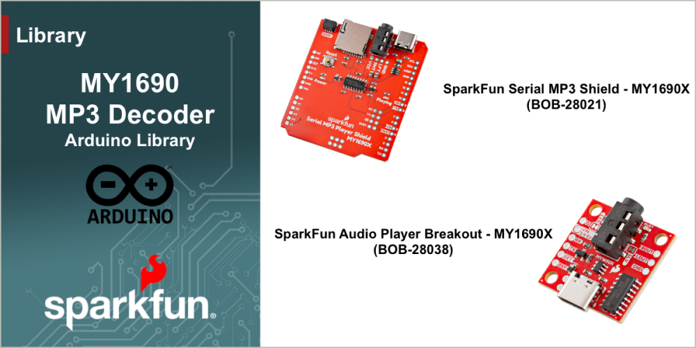

# SparkFun MY1690 MP3 Decoder Arduino Library

Arduino Library for the SparkFun MY1690 MP3 enabled breakout boards

This library provides full access to the functions of the MY1690 MP3 decoder through a serial connection and a "busy" pin. This library is very simple to use with either a hardware or software serial port. The simple dependencies (HardwareSerial and SoftwareSerial) make it suitable for use on any Arduino-compatible platform.

The MY1690 combines two functions needed to play .mp3 files into one package and adds a simple serial control interface. Normally to play a .mp3 file one would need to choose a decoder IC AND provide a method for storing and selecting the files. The MY1690 removes that complexity by combining an SD card interface and .mp3 decoder. Now in order to play a song all you need to do is save it to an SD card, plug it into the MY1690 breakout, and send a few commands over serial. This allows you to easily integrate sound into any Arduino project.

### Supported Products
This library is intended for use with the following SparkFun Products - available at [www.sparkfun.com](https://www.sparkfun.com). 

| Product | Description|
|--|--|
|[MY160 MP3 Audio Player - MY1690 Breakout board](https://www.sparkfun.com/products/28021) | The SparkFun Audio Player Breakout - M71690X-16S is a compact serial-controlled audio player designed around the MY1690X-16S decoder that supports both .WAV and .MP3 audio files played from a connected microSD card formatted to FAT16 or FAT32.|
 |[Serial MP3 Shield - MY1690](https://www.sparkfun.com/products/14808)| The SparkFun Serial MP3 Player Shield - MY1690X is an awesome decoder with the capability of storing music files onto a standard microSD card, giving you the ability to add music or sound effects to any project|

## Documentation

|Reference | Description |
|---|---|
|[Library Documentation](https://docs.sparkfun.com/SparkFun_MY1690_MP3_Decoder_Arduino_Library/)| The full documentation and API for this Arduino library|
|[SparkFun Serial MP3 Player Shield](https://github.com/sparkfun/SparkFun_Serial_MP3_Player_Shield-MY1690X/)| Hardware GitHub Repository|
|[Hook Up Guide - MP3 Player Shield](https://docs.sparkfun.com/SparkFun_Serial_MP3_Player_Shield-MY1690X/) | Hardware Overview and Quick Start for the Serial MP3 Player Shield - MY1690|
|[SparkFun Audio Player Beakout](https://github.com/sparkfun/SparkFun_Audio_Player_Breakout_MY1690X-16S)| Hardware GitHub Repository|
|[Hook Up Guide - Audio Player Breakout](https://docs.sparkfun.com/SparkFun_Audio_Player_Breakout_MY1690X-16S/) | Hardware Overview and Quick Start for the Audio Player Breakout - MY1690|
|[MY1690 IC Datasheet](docs/MY1690X-16SMY1690X‑16S_Voice_Module_User_Manualen.pdf) | Datasheet for the MY1690 IC|
|[Installing an Arduino Library Guide](https://learn.sparkfun.com/tutorials/installing-an-arduino-library)| Basic information on how to install an Arduino library|

## Examples

The following examples are provided with the library

| Example | Description |
|---|---|
|[Play File](examples/Example1_PlayFile/Example1_PlayFile.ino)| Play a single .MP3 or .WAV file from the uSD card.
|[Kitchen Sink](examples/Example2_KitchenSink/Example2_KitchenSink.ino)| The MY1690 has a large number of features. This example presents the user with a serial menu to control the all aspects of the IC.|
|[Kitchen Sink ESP32](examples/Example3_KitchenSink_ESP32/Example3_KitchenSink_ESP32.ino)| Kitchen Sink example, using Hardware Serial on an ESP32 setup on pins 26 and 27.|

## License Information

This product is ***open source***!

This product is licensed using the [MIT Open Source License](https://opensource.org/license/mit).